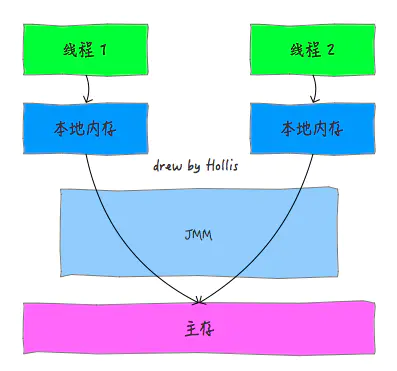
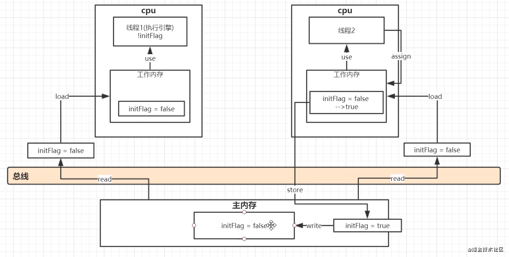

# JMM简介 

> JMM即Java内存模型(Java memory model)，在JSR133里指出了JMM是用来定义一个**一致的、跨平台**的内存模型，是缓存一致性协议，用来定义数据读写的规则。

## CPU多核并发缓存架构


## JMM 内存模型

> ​		Java 内存模型就是一种符合内存模型规范的，屏蔽了各种硬件和操作系统的访问差异的，保证了Java程序在各种平台下对内存的访问都能保证效果一致性的机制和规范。
>
> ​		Java内存模型规定了所有的变量都存储在主内存中，每个线程还有自己的工作内存，线程的工作内存中保存了该线程需要使用到的变量的主内存拷贝过来的副本，线程对变量的所有操作都必须在工作内存中进行，而不能直接读写操作主内存。不同的线程之间也无法直接访问对方工作内存中的变量，线程间变量的传递需要自己的个工作内存和主内存之间进行数据同步。
>
> ​		而JMM就作用于工作内存和主内存之间数据同步过程。他规定了如何做数据同步已经什么时候做数据同步。



> ​		在《深入理解Java虚拟机》中认为，如果一定要把主内存和工作内存对应到JVM内存结构的话，主内存对应于java堆中的对象实例数据部分，而工作内存对应虚拟机栈中的部分区域。
>
> **总结：JMM是一种规范，目的是为了解决由于多线程通过共享内存进行通讯时，存在的本地内存数据不一致、编译器优化代码指令重排序带来的问题**

# JMM 底层八大原子操作

> 主要是 主内存和工作内存之间的数据拷贝

- read（读取）：从主内存读取数据
- load（载入）：将主内存读取到的数据写入到工作内存
- use（使用）：从工作内存读取数据来计算
- assign（赋值）：将计算好的值重新赋值到工作内存中
- store（存储）：将工作内存数据写入到主内存
- write（写入）：将store过去的变量赋值给主内存中的变量
- lock（锁定）：将主内存变量加锁，标识为线程独占状态
- unlock（解锁）：将主内存变量解锁

# Java内存模型带来的问题

## 内存可见性

> 看下面这一段代码，执行结果是：
>
> 修改initFlag的值
> 修改完成
>
> 有人会有疑问？：为什么不输出“线程A结束”
>
> 理由：在Java中，不同线程拥有各自的私有**工作内存**，当线程需要读取或修改某个变量时，不能直接去操作**主内存**中的变量，而是需要将这个变量读取到线程的**工作内存**的**变量副本**中，当该线程修改其变量副本的值后，**其它线程并不能立刻读取到新值**，需要将修改后的值**刷新到主内存中**，其它线程才能**从主内存读取到修改后的值**。
>
> 解决方案：在initFlag变量加入volatile关键字

```java
public class Demo {
    private static boolean initFlag = false;
    public static void main(String[] args) throws InterruptedException {
        new Thread(() -> {
            while (!initFlag) {

            }
            System.out.println("线程A结束");
        }).start();
        Thread.sleep(2 * 1000);
        new Thread(() -> {
            System.out.println("修改initFlag的值");
            initFlag = true;
            System.out.println("修改完成");
        }).start();
    }
}
```



> 这是通过JMM 底层八大原子操作 操作主内存和工作内存的流程

## 指令重排序

> 在执行程序时，为了提高性能，编译器和处理器常常会对指令做重排序

### 重排序类型


1. 编译器优化重排序：编译器在不改变单线程程序语义的前提下，可以安排语句的执行顺序。
2. 指令并行重排序：现代CPU处理器采用了指令级并行技术来将多条指令重叠执行。如果不存在数据性依赖，CPU可以改变语句对应机器指令的执行顺序。
3. 内存系统的重排序：由于CPU使用缓存和读/写缓冲区，这使得加载和存储操作看起来可能是在乱序执行。

### 重排序规则

- 数据依赖性：如果两个操作访问同一个变量，并且这两个操作中有一个为写操作，此时这两个操作之间就存在数据依赖。数据依赖分为下列三种类型，这三种情况如果重排序这两个操作执行顺序，程序的执行结果就会被改变。

  | 名称   | 代码示例 | 说明                               |
  | ------ | -------- | ---------------------------------- |
  | 写后读 | a=1;b=a; | 写一个变量，在读取这个变量的值     |
  | 写后写 | a=1;a=2; | 写一个变量，在写入同一个变量       |
  | 读后写 | b=a;a=3; | 先读取一个变量，在修改这个变量的值 |

- 控制依赖：

- as-if-serial:不管如何重排序，都必须保证代码在单线程下执行结果不能被改变。编译器、Runtime、CPU都必须遵守as-if-serial语义。为了遵守这个语义，编译器和CPU不会对存在数据依赖关系和操作进行重排序。

  ```java
  a=1;//1
  b=1;//2
  a+b;//3
  ```

  1和3存在数据依赖关系，2和3也存在数据依赖关系，所以3可能被重排序到1和2的前面执行。但是1和2之间不存在数据依赖，编译器和CPU可以重排序1和2之间的执行顺序