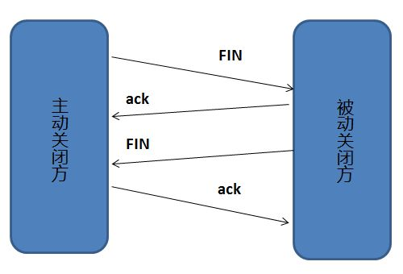

# OSI网络七层模型和协议

# TCP 三次握手和四次挥手

> 为了准确无误的把数据送达目的地，TCP协议采用三次握手策略

## TCP 三次握手漫画图解

如下图所示，下面的两个机器通过3次握手确定了对方能正确接收和发送消息

**简单示意图：**

- 客户端–发送带有 SYN 标志的数据包–一次握手–服务端
- 服务端–发送带有 SYN/ACK 标志的数据包–二次握手–客户端
- 客户端–发送带有带有 ACK 标志的数据包–三次握手–服务端

## 为什么要三次握手

**三次握手的目的是建立可靠的通信信道。说到通信，简单来说就是数据的发送和接收，而三次握手的主要目的就是双方确认自己与对方的发送与接收是正常的。**

第一次握手：Client 什么都不能确定，Server确定了对方是可以正常发送消息的,自己是正常接受数据的。

第二次握手：Client确定了自己发送和接收是正常的，对方发送和接收也是正常的；Server确定了对方发送正常和自己接收正常。

第三次握手：Client确定了自己发送和接收是正常的，对方发送和接收也是正常的；Server确定了自己发送和接收是正常的，对方发送和接收也是正常的

所以三次握手就能确定双方的接收和发送数据都是正常的，缺一不可。

## 第二次握手传回了ACK，为什么还要传回SYN

接收端返回给客户端的ACK是为了告诉客户端，我接收到了你刚刚发送的信号了，这表明从客户端到服务端的通信是正常的。而回传SYN则是为了建立并确定服务端到客户端的正常通信。

> SYN是TCP/IP建立连接时使用的握手信号。在客户机和服务器之间建立正常的TCP网络连接时，客户端先发出一个SYN消息，服务端回复SYN-ACK应答表示接受到这个消息,最后客户端在以ACK消息响应。这样就在客户端和服务端建立了可靠的TCP连接，数据才可以在客户端和服务端之间传输。

## 为什么要四次挥手

断开一个TCP连接则需要“四次挥手”：

- 客户端-发送一个FIN，用来关闭客户端到服务端的数据传送。
- 服务端-收到这个FIN，它回复一个ACK，确认序号为收到的序号+1。和SYN一样，一个FIN占一个序号
- 服务端-关闭与客户端的连接，发送一个FIN给客户端
- 客户端-收到服务端的FIN信号，回复ACK报文确认

任何一方就可以在数据传输结束后发出释放连接的通知，待对方确认后进入半关闭状态。当另一方也没有数据发送的时候，则也回发出释放通知，对方确认后就可以完全关闭TCP连接啦。

## 为什么建立连接是三次握手，关闭连接确是四次挥手

​		建立连接的时候， 服务器在LISTEN状态下，收到建立连接请求的SYN报文后，把ACK和SYN放在一个报文里发送给客户端。
而关闭连接时，服务器收到对方的FIN报文时，仅仅表示对方不再发送数据了但是还能接收数据，而自己也未必全部数据都发送给对方了，所以己方可以立即关闭，也可以发送一些数据给对方后，再发送FIN报文给对方来表示同意现在关闭连接，因此，己方ACK和FIN一般都会分开发送，从而导致多了一次。

# TCP,UDP协议区别

UDP 在传送数据之前不需要先建立连接，远地主机在收到 UDP 报文后，不需要给出任何确认。虽然 UDP 不提供可靠交付，但在某些情况下 UDP 确是一种最有效的工作方式（一般用于即时通信），比如： QQ 语音、 QQ 视频 、直播等等

TCP 提供面向连接的服务。在传送数据之前必须先建立连接，数据传送结束后要释放连接。 TCP 不提供广播或多播服务。由于 TCP 要提供可靠的，面向连接的传输服务（TCP的可靠体现在TCP在传递数据之前，会有三次握手来建立连接，而且在数据传递时，有确认、窗口、重传、拥塞控制机制，在数据传完后，还会断开连接用来节约系统资源），这一难以避免增加了许多开销，如确认，流量控制，计时器以及连接管理等。这不仅使协议数据单元的首部增大很多，还要占用许多处理机资源。TCP 一般用于文件传输、发送和接收邮件、远程登录等场景。

# TCP协议如何保证可靠性传输

1. 应用数据被分割成TCP认为最适合发送的数据块
2. TCP给发送的每一个包进行编号，接受方对数据包进行排序，把有序数据传输给应用层
3. TCP接收端会丢弃重复的数据
4. **校验和**：TCP将保持它首部和数据的校验和。这是一个端到端的校验和，目的是检测数据在传输过程中是否发生过变化。如果收到的数据校验和有差错，则TCP会丢弃这个报文并不会发生ACK确认这个报文。
5. **流量控制**：TCP连接的每一方都有固定大小的缓冲空间，TCP的接收端只允许发生接收端缓冲区能接纳的数据。当接收方来不及处理发送过来的数据，能提示发送方降低发送的速率，防止包丢失。
6. **拥塞控制：**当网络阻塞时，减少数据的发送。
7. **ARQ协议：**也是为了实现可靠传输的，基本原理就是每次发送完一个分组就停止发送，等待对方确认。在收到确认后在发下一分组数据。
8. **超时重传：** 当TCP发送一个段后，它会启动一个定时器，等待目的端的确认收到这个报文段。如果不能及时收到确认，将重新发送这个报文段。

## ARQ协议

**自动重传请求** 是OSI模型中数据链路层和传输层的错误纠正协议之一。它通过使用确认和超时这两个机制，在不可靠服务的基础上实现可靠传输。如果发送方在发送后一段时间之内没有收到确认帧，它通常会重新发送。ARQ包括停止等待ARQ协议和连续ARQ协议。

### 停止等待ARQ协议

停止等待协议是为了实现可靠传输的，它的基础原理就是没发完一个分组就停止发送，等待对方确认（回复ACK）。如果过了一段时间（超时后）还是没收到ACK确认，说明没有发送成功，需要重新发送，知道收到确认后在发下一个分组。

在停止等待协议中，若接收方收到重复的分组，就丢弃分组，但同时需要回复ACK确认。

**优缺点**

- 优点：简单
- 缺点：信道利用率低，等待时间长。

1. **无差错情况**：发送方发送分组,接收方在规定时间内收到,并且回复确认.发送方再次发送。

2. **出现差错情况（超时重传）**：

   停止等待协议中超时重传是指只要超过一段时间仍然没有收到确认，就重传前面发送过的分组（认为刚才发送过的分组丢失了）。因此每发送完一个分组需要设置一个超时计时器，其重传时间应比数据在分组传输的平均往返时间更长一些。这种自动重传方式常称为 **自动重传请求 ARQ** 。另外在停止等待协议中若收到重复分组，就丢弃该分组，但同时还要发送确认。**连续 ARQ 协议** 可提高信道利用率。发送维持一个发送窗口，凡位于发送窗口内的分组可连续发送出去，而不需要等待对方确认。接收方一般采用累积确认，对按序到达的最后一个分组发送确认，表明到这个分组位置的所有分组都已经正确收到了。）

3. **确认丢失和确认迟到**

   - **确认丢失** ：确认消息在传输过程丢失。当A发送M1消息，B收到后，B向A发送了一个M1确认消息，但却在传输过程中丢失。而A并不知道，在超时计时过后，A重传M1消息，B再次收到该消息后采取以下两点措施：1. 丢弃这个重复的M1消息，不向上层交付。 2. 向A发送确认消息。（不会认为已经发送过了，就不再发送。A能重传，就证明B的确认消息丢失）。

   - **确认迟到** ：确认消息在传输过程中迟到。A发送M1消息，B收到并发送确认。在超时时间内没有收到确认消息，A重传M1消息，B仍然收到并继续发送确认消息（B收到了2份M1）。此时A收到了B第二次发送的确认消息。接着发送其他数据。过了一会，A收到了B第一次发送的对M1的确认消息（A也收到了2份确认消息）。处理如下：1. A收到重复的确认后，直接丢弃。2. B收到重复的M1后，也直接丢弃重复的M1。

### 连续ARQ协议

连续 ARQ 协议可提高信道利用率。发送方维持一个发送窗口，凡位于发送窗口内的分组可以连续发送出去，而不需要等待对方确认。接收方一般采用累计确认，对按序到达的最后一个分组发送确认，表明到这个分组为止的所有分组都已经正确收到了。

**优缺点：**

- **优点：** 信道利用率高，容易实现，即使确认丢失，也不必重传。
- **缺点：** 不能向发送方反映出接收方已经正确收到的所有分组的信息。 比如：发送方发送了 5条 消息，中间第三条丢失（3号），这时接收方只能对前两个发送确认。发送方无法知道后三个分组的下落，而只好把后三个全部重传一次。这也叫 Go-Back-N（回退 N），表示需要退回来重传已经发送过的 N 个消息。

## 滑动窗口和流量控制

**TCP 利用滑动窗口实现流量控制。流量控制是为了控制发送方发送速率，保证接收方来得及接收。** 接收方发送的确认报文中的窗口字段可以用来控制发送方窗口大小，从而影响发送方的发送速率。将窗口字段设置为 0，则发送方不能发送数据。

## 拥塞控制

在某段时间，若对网络中某一资源的需求超过了该资源所能提供的可用部分，网络的性能就要变坏。这种情况就叫拥塞。拥塞控制就是为了防止过多的数据注入到网络中，这样就可以使网络中的路由器或链路不致过载。拥塞控制所要做的都有一个前提，就是网络能够承受现有的网络负荷。拥塞控制是一个全局性的过程，涉及到所有的主机，所有的路由器，以及与降低网络传输性能有关的所有因素。相反，流量控制往往是点对点通信量的控制，是个端到端的问题。流量控制所要做到的就是抑制发送端发送数据的速率，以便使接收端来得及接收。

为了进行拥塞控制，TCP 发送方要维持一个 **拥塞窗口(cwnd)** 的状态变量。拥塞控制窗口的大小取决于网络的拥塞程度，并且动态变化。发送方让自己的发送窗口取为拥塞窗口和接收方的接受窗口中较小的一个。

TCP的拥塞控制采用了四种算法，即 **慢开始** 、 **拥塞避免** 、**快重传** 和 **快恢复**。在网络层也可以使路由器采用适当的分组丢弃策略（如主动队列管理 AQM），以减少网络拥塞的发生。

- **慢开始：** 慢开始算法的思路是当主机开始发送数据时，如果立即把大量数据字节注入到网络，那么可能会引起网络阻塞，因为现在还不知道网络的符合情况。经验表明，较好的方法是先探测一下，即由小到大逐渐增大发送窗口，也就是由小到大逐渐增大拥塞窗口数值。cwnd初始值为1，每经过一个传播轮次，cwnd加倍。
- **拥塞避免：** 拥塞避免算法的思路是让拥塞窗口cwnd缓慢增大，即每经过一个往返时间RTT就把发送放的cwnd加1.
- **快重传与快恢复：** 在 TCP/IP 中，快速重传和恢复（fast retransmit and recovery，FRR）是一种拥塞控制算法，它能快速恢复丢失的数据包。没有 FRR，如果数据包丢失了，TCP 将会使用定时器来要求传输暂停。在暂停的这段时间内，没有新的或复制的数据包被发送。有了 FRR，如果接收机接收到一个不按顺序的数据段，它会立即给发送机发送一个重复确认。如果发送机接收到三个重复确认，它会假定确认件指出的数据段丢失了，并立即重传这些丢失的数据段。有了 FRR，就不会因为重传时要求的暂停被耽误。 　当有单独的数据包丢失时，快速重传和恢复（FRR）能最有效地工作。当有多个数据信息包在某一段很短的时间内丢失时，它则不能很有效地工作。

# 在浏览器中输入url地址发生的过程

总体来说分为以下几个过程:

1. DNS解析
2. TCP连接
3. 发送HTTP请求
4. 服务器处理请求并返回HTTP报文
5. 浏览器解析渲染页面
6. 连接结束